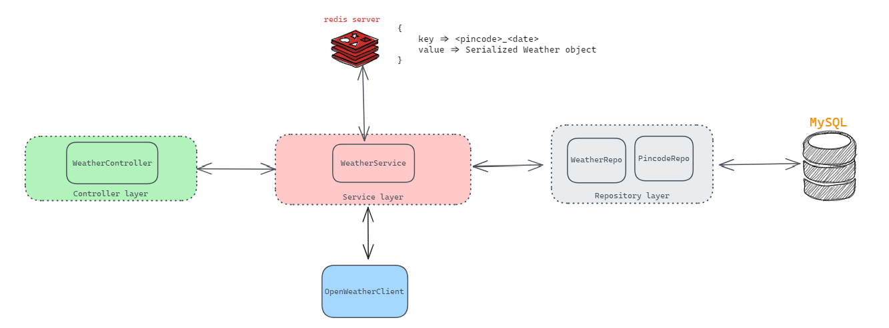

# TDD Open Weather Wrapper



## Notes
1. Tests - wrote 18 tests for all layers and components using Junit5 and Mockito.
2. MySQL for persistence
3. for optimizing, used redis as cache at service layer.
    * Non-cached weather request takes **687 ms** while cached takes only **11 ms**
    * following key:value pair is being cached (refer `redis_kv_cache.png`)
    ```
    { 
        key => <pincode>_<date>
        value => Serialized Weather object
    }
    ```


## Setup:
1. To test on local machine, start redis server using `redis-server` (default port)
2. paste requried fields
```
spring.datasource.url=jdbc:mysql://<host>:3306/<schema>
spring.datasource.username=<username>
spring.datasource.password=<password>

# Open Weather Client
weather.url=https://api.openweathermap.org
weather.api_secret=<appId-paste-here>

```

## API
url: http://localhost:8082/
|METHOD|endpoint|required params|
|---|------------------------------------|---|
|POST |`/api/v1/weather`|pincode, date(pattern = "dd-MM-yyyy")|
### Example of API Response 

url: http://localhost:8082/api/v1/weather?pincode=147001&date=05-06-2023
```--data-raw 
{
    "pincode": 147001,
    "place": "Nābha",
    "date": "2023-06-05",
    "temperature": 313.48,
    "description": "clear sky"
}
```

Error: Invalid Pincode
```
{
    "timestamp": "2023-06-06T16:30:14.872+00:00",
    "status": 404,
    "error": "Not Found",
    "message": "Provided pincode is invalid.",
    "path": "/api/v1/weather"
}
```